# AURORA Player · 全部界面说明

[返回产品首页](README.md) · [下载正式版](https://github.com/Howard9088/AURORA_Player/releases/latest)

以下图片为当前程序的实际界面，使用示例曲库及模拟试用状态展示。音乐资料和可视化状态仅用于界面说明。页面中的高级功能须处于有效试用或全功能授权期。

## 正在播放

**入口：** 左侧「正在播放」。上方显示歌名、歌手和圆圈 i；中间是封面、动态歌词与实时点阵频谱；下方显示文件格式、采样率、位深 / 码率及来源。底部播放条可暂停、切歌、拖动进度、随机播放、循环和收藏。右侧保留声音控制和输出设备。

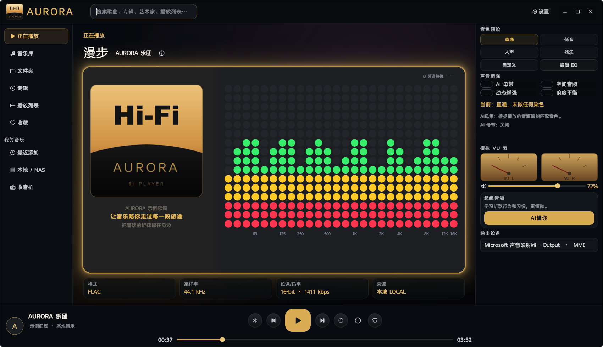

## 音乐库

**入口：** 左侧「音乐库」。查看全部歌曲的标题、艺术家、专辑、格式、采样率和时长。可添加单个文件、导入文件夹或重新扫描；双击歌曲播放，右键可加入队列或列表、查看资料以及执行曲库操作。顶部搜索框用于查找音乐。

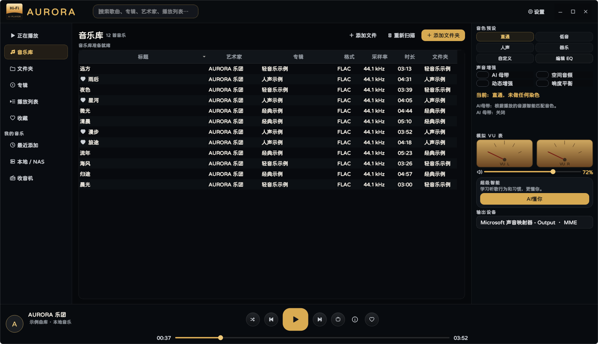

## 文件夹

**入口：** 左侧「文件夹」。左侧目录树保留你的音乐目录层级，右侧列出所选范围内的歌曲。支持添加、移除扫描目录和重新扫描；从此页也能打开 CUE 整轨分轨。不同目录里的同一首歌曲在各自目录中仍可查看。

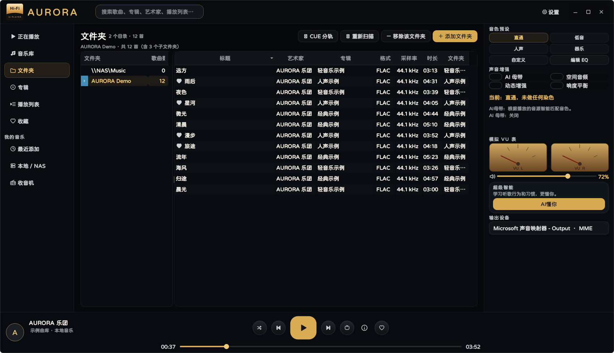

## 专辑

**入口：** 左侧「专辑」，或曲目菜单中的专辑入口。左边选择专辑，右边查看该专辑的歌曲和音质信息。专辑归类依赖文件标签和已入库资料，双击曲目即可开始播放。

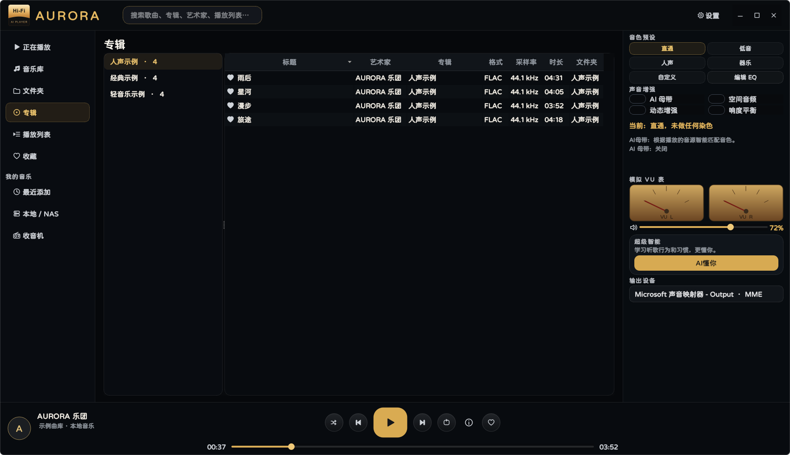

## 播放列表与 AI DJ

**入口：** 左侧「播放列表」。普通播放列表支持拖动排序并保存；全功能版的「AI DJ · 全量智能」从曲库生成推荐，优先参考点心、听完和回听等行为，并保留一定探索空间。「按文件夹」智能列表只在选定目录及子目录内推荐；点击「重新推荐」重新生成。

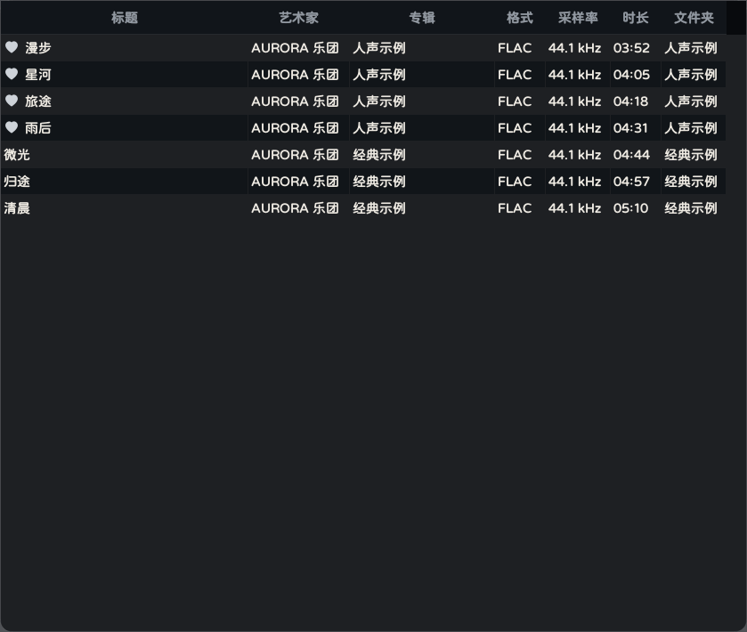

## 收藏

**入口：** 左侧「收藏」。显示明确点心的歌曲，便于集中播放。播放条或曲目列表中的心形按钮可修改收藏状态；免费版也能使用。

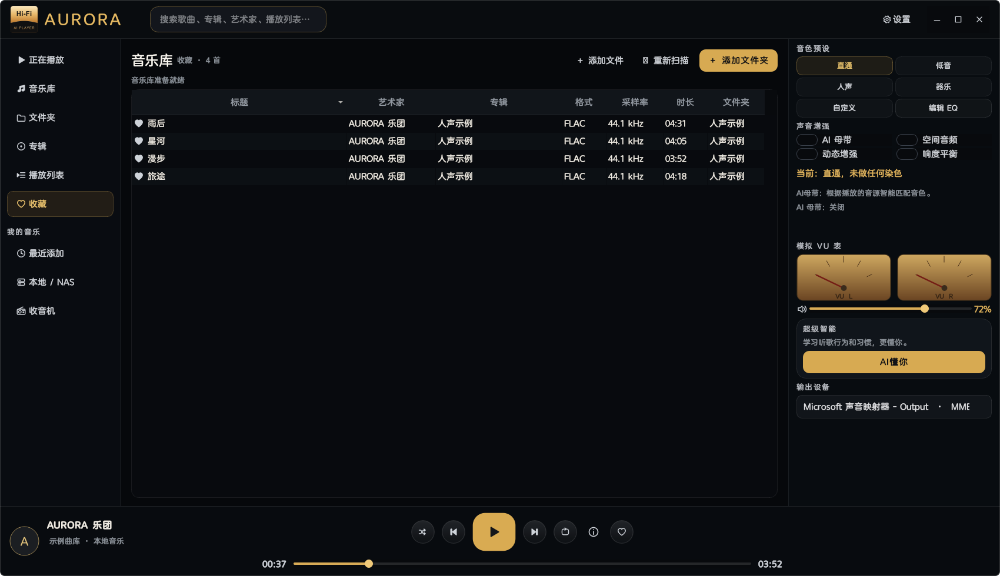

## 最近添加

**入口：** 左侧「最近添加」。按入库时间展示音乐，快速找到刚导入的歌曲。这里沿用音乐库的播放、收藏和曲目菜单。

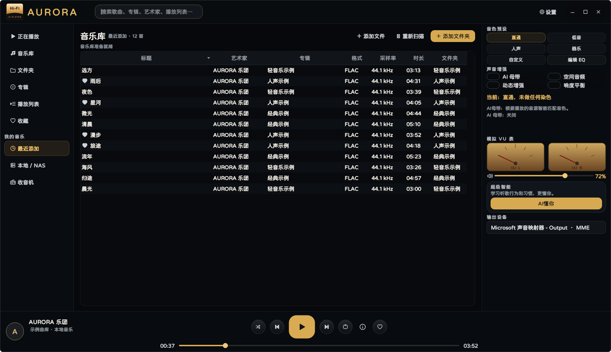

## 本地 / NAS

**入口：** 左侧「本地 / NAS」。选择本地文件夹，或填写 Windows 已能访问的 NAS / SMB 路径，然后连接并扫描。已保存目录可再次扫描或移除。NAS 访问权限需先在 Windows 中配置，本页不会替代 NAS 的账户与共享设置。

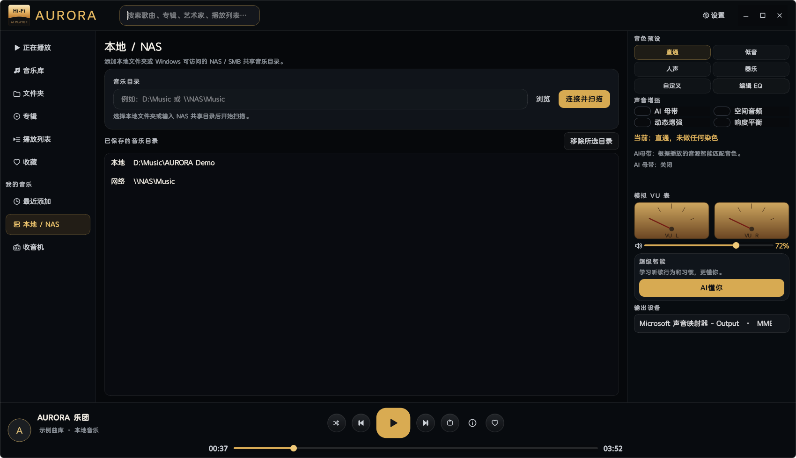

## 歌手资料

**入口：** 播放页的歌手区域、播放条头像或歌曲的歌手入口。查看可获取的公开头像与简介，并集中浏览本地曲库里属于该歌手的歌曲。网络资料缺失时，仍保留本地曲目列表；不会为了填满简介而虚构歌手资料。

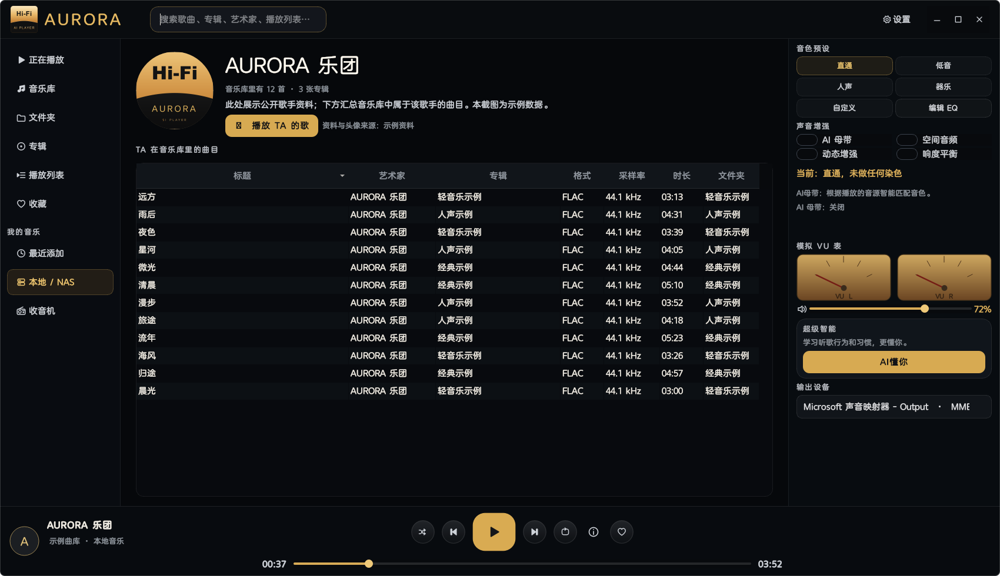

## AI 学习与偏爱

**入口：** 设置中的「AI 学习与偏爱」。全功能版可开关听歌行为学习，进入点心 / 不喜欢歌曲列表，查看学习结果，或重置学习。判断综合多种行为；一次快速切歌不直接等于长期不喜欢，用户可复核并纠正记录。

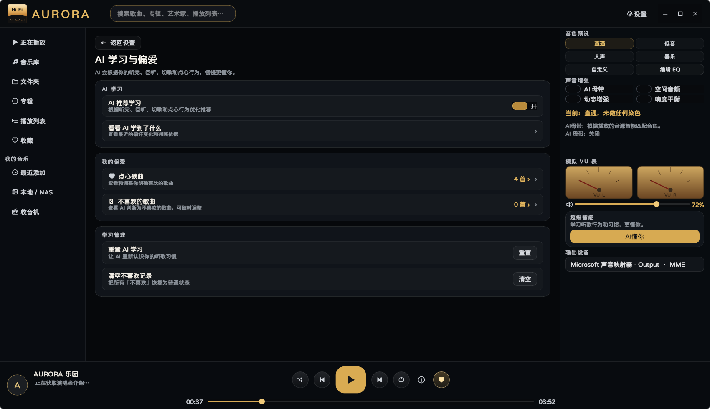

## AI 懂你

**入口：** 「AI 学习与偏爱 → 看看 AI 学到了什么」；右侧「AI 懂你」按钮会进入智能推荐入口。学习结果页展示积累程度、偏好标签、分时段行为统计、最近学到的内容和判断依据。这里的结果来自听歌记录，新曲库需要逐步积累。

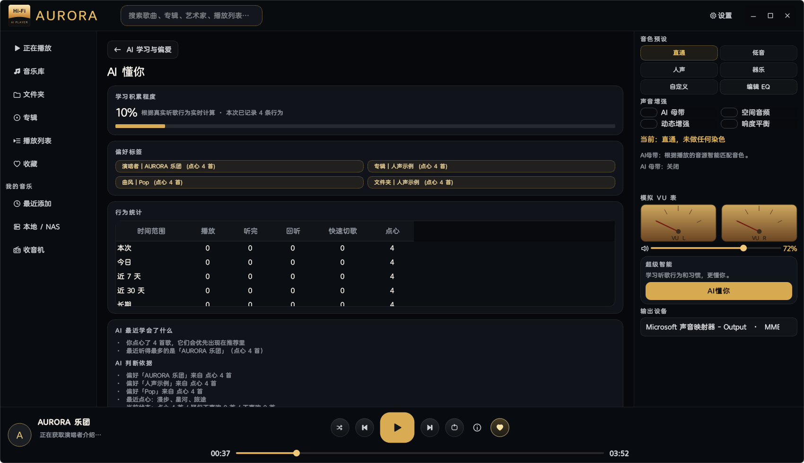

## 设置

**入口：** 右上角「设置」。可即时切换界面语言，开关启动扫描、缺失歌词与封面的在线匹配，以及歌词旁置保存。页面可滚动，进一步查看曲库维护和支持格式；「为爱发电」为独立页签。

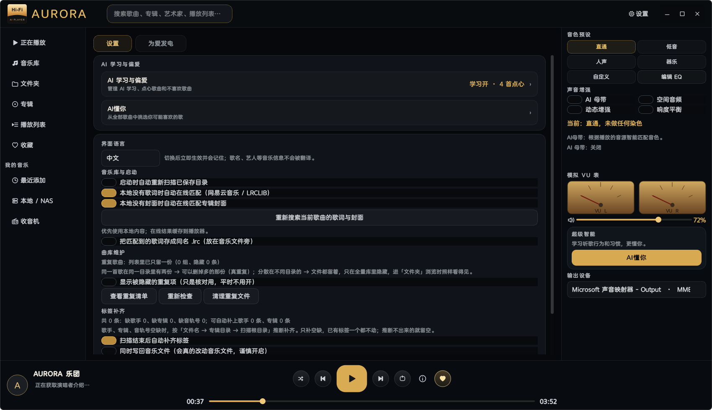

## 曲库维护与标签补齐

**入口：** 设置页面向下滚动。重复检查用于区分同目录多份文件与跨目录副本；先查看清单再决定清理。全功能版的标签补齐根据明确的文件名和目录信息补充空缺的歌手、专辑、曲号等，已有标签保留；「写回音乐文件」为另行勾选的选项，会修改音乐文件。

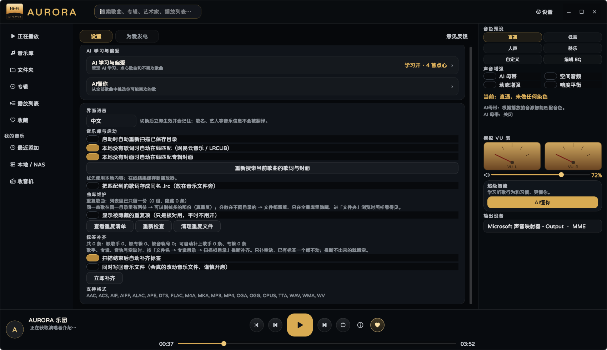

## 为爱发电

**入口：** 「设置 → 为爱发电」。可打开 ¥10 / 30 天或 ¥98 买断商品，粘贴爱发电私信收到的激活码，或重新核验授权。30 天付费授权从首次自动核验付款成功起算。页面显示当前试用 / 授权状态、到期时间及软件版权信息；两个付费方案开放相同功能。

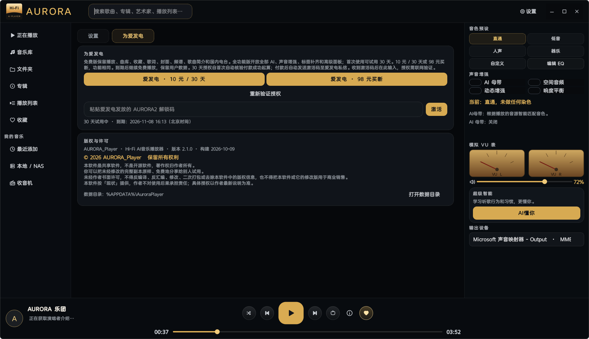

## 播放面板设置

**入口：** 正在播放的面板「设置」入口，翻到面板背面。全功能版可调整透光、频谱配色、氛围灯颜色及动态，以及玻璃 / 金属面板材质。设置实时应用；返回面板正面继续查看封面与频谱。

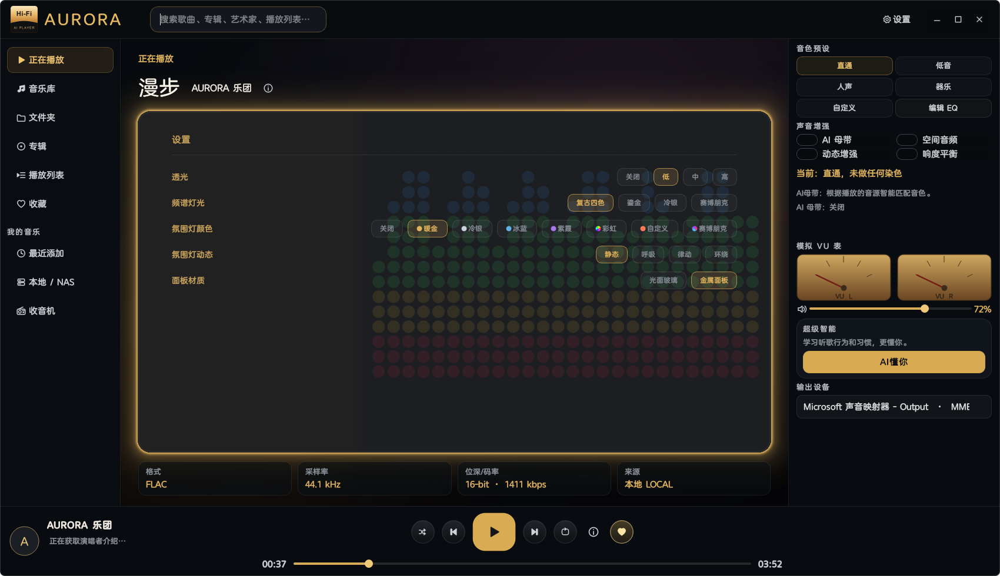

## 声音控制与九段 EQ

**入口：** 主窗口右侧固定声音面板，「编辑 EQ」打开九段均衡器。可选择直通、低音、人声、器乐或自定义预设，调整音量及输出设备。九段 EQ 支持各频段 −12 至 +12 dB。全功能版可启用 AI 母带、空间音频、动态增强和响度平衡；界面显示当前处理状态，AI 与手工控制按各自链路规则工作。

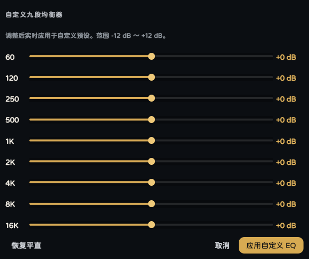

## 播放队列

**入口：** 播放控制区域的队列按钮，或右键将歌曲加入播放队列。窗口显示当前及待播曲目，可上移、下移、移除或清空队列；双击指定曲目播放。调整待播顺序不要求重新导入曲库。

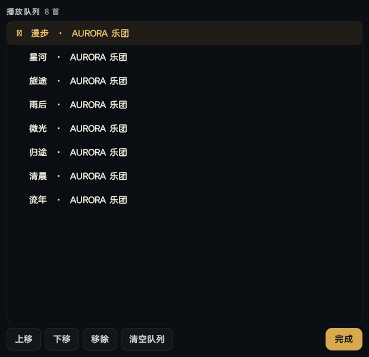

## 新建播放列表

**入口：** 「播放列表 → 新建播放列表」。填写名称，选择普通手工列表或全功能版的「按文件夹 AI」类型。智能列表需选择目录范围，后续从这个范围内动态推荐；普通列表由你添加歌曲并排序。

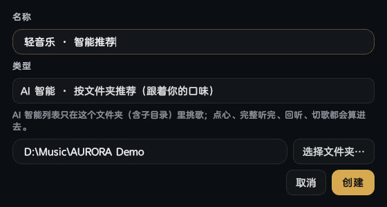

## CUE 整轨分轨

**入口：** 文件夹页的 CUE 分轨按钮。选择 `.cue` 后查看曲名、表演者、起点和时长，指定输出目录并确认分轨。可勾选完成后将生成的单曲加入音乐库；解析和分轨结果在窗口内显示。曲库也支持通过 CUE 浏览整轨中的虚拟曲目。

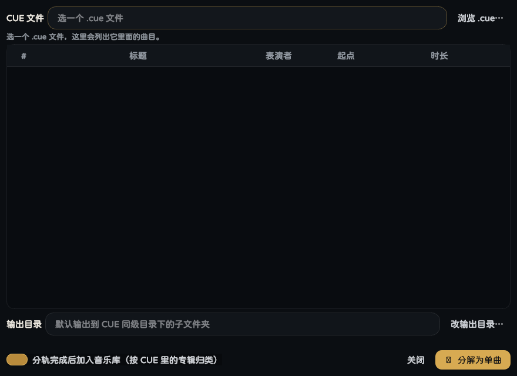

## 收音机

**入口：** 左侧「收音机」。选择国内地区或收藏，按电台名称搜索并收听；可收藏常听电台，暂停或停止收听。此窗口独立于曲库页，电台目录及直播流需要联网，可用性取决于对应电台。

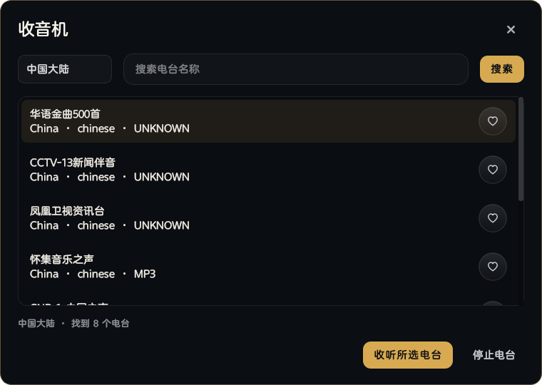

## 歌曲简介

**入口：** 歌曲信息旁的圆圈 i，或「更多 → 歌曲简介」。独立窗口依次展示歌曲资料、歌手、专辑、创作信息和资料来源。有可靠数据才显示；歌曲首次发行与当前专辑版本发行日期分别处理。查询优先本地标签，再使用 MusicBrainz、Wikidata / Wikipedia 等公开来源，不调用 AI 生成资料。打开、关闭和重新查询均不改变播放进度或队列。

本例仅有本地标签，因而只展示能确认的字段。

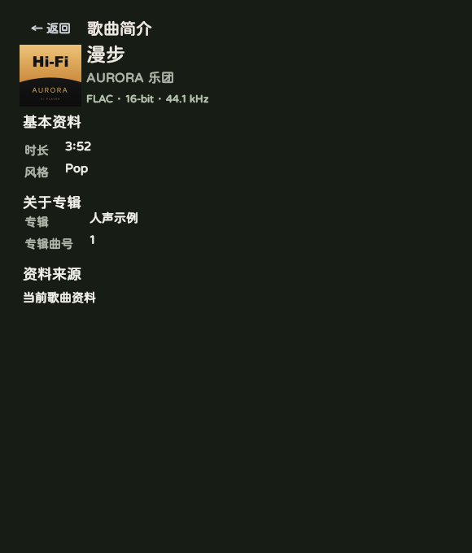

## 重复歌曲清单

**入口：** 「设置 → 查看重复清单」。对照歌曲、保留 / 隐藏状态、音质和文件位置，核对多份文件。打开清单本身不会删除音乐；跨目录副本可以保留，仅在全量曲库中合并展示。

## 点心歌曲

**入口：** 「AI 学习与偏爱 → 点心歌曲」。全功能版可搜索、排序并查看歌曲状态、听完和回听等统计，也可调整偏爱状态。这里服务于学习管理；基础的收藏功能在免费版仍然可用。

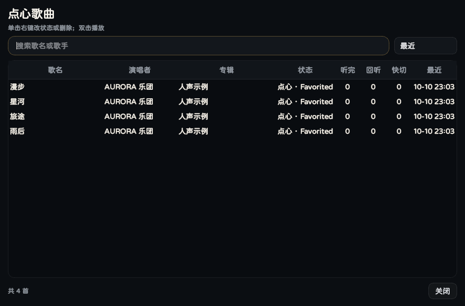

## 不喜欢的歌曲

**入口：** 「AI 学习与偏爱 → 不喜欢的歌曲」。查看疑似或已确认的不喜欢记录，结合行为统计复核判断并修改状态。可以把歌曲恢复为普通状态；没有记录时显示空列表。

[返回产品首页](README.md)
